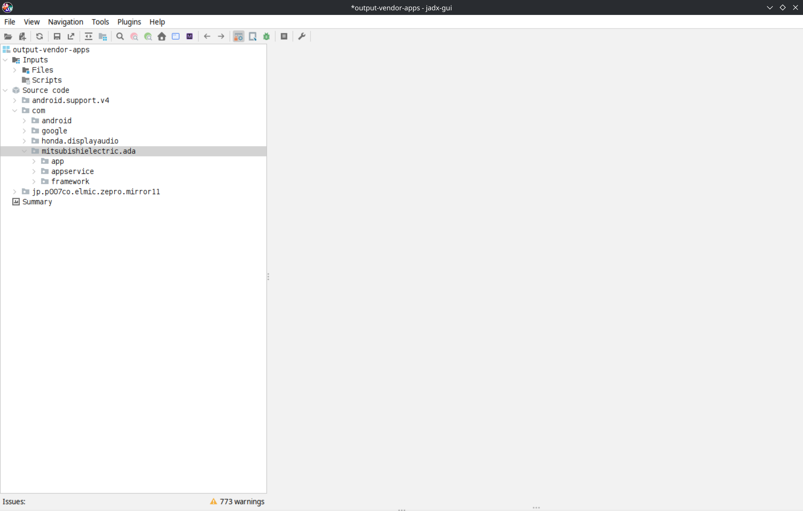

# Honda Civic APK Rebuilder
Script to quickly reconstruct full .apk files from 10th generation Honda Civic `MRC<...>.zip` update files.

## Requirements
- A Honda Civic update file; I can't host it here directly
- A recent version of Java (I'm using `openjdk 21.0.7-ea 2025-04-15`)
- A recent version of Python, >= Python 3.10+ (I'm using `Python 3.13.3`)

## Usage
1. Find a 10th generation Honda Civic update file on the internet. For copyright reasons I'm not linking it directly, but it should be easy to find. The filename looks something like this: `MRC<...>.zip` (where `<...>` contains version info)
2. Ensure you have Java installed (see requirements)
3. Ensure you have Python installed (see requirements)
4. Clone this repo and cd into the same directory as this README.md file.
5. Copy your update file somewhere accessible. I use `./inputs/MRC<...>.zip`, relative to this directory.
6. Run `python3 main.py ./inputs/MRC<...>.zip` (I'm on Linux; the specific syntax may vary if you're on Windows)
7. If all goes well, you'll have nice `.apk` files in the `./build/output-vendor-apps/` directory
8. Install the [jadx GUI tool](https://github.com/skylot/jadx)
9. In the JADX GUI, click `File` > `Open project` and select the `./build/output-vendor-apps/` directory.
10. When prompted to "Load all files from directory?" choose "Yes".

Now inside JADX on the left-side pane you should be able to expand `Source code` and find the Mitsubishi
source code under `Source code` > `com` > `mitsubishielectric.ada`. If you got this far, congrats! If you had trouble, create an issue or make a PR so I can address it and make this script better for everyone.

Running the script from start to finish should only take a minute or two.

## Compatibility
I tried to make this script compatible cross-platform. At the time of writing I've only tested in on Debian Linux, but it's an intentionally lean Python script that has no dependencies beyond the Python standard library and relies on standard library tools for things like path and file manipulations.

## JADX GUI Screenshot

## Motivation
If you want to view the source code for the vendor apps on the headunit, it's kind of a pain.
Without a script, you have to do the following:
- Find and download the `MRC<...>.zip` file on the internet
- Extract the `MRC<...>.zip` file
- Within the extracted file contents, locate the `SwUpdate.mdt` file
- Extract the `SwUpdate.mdt` file (it's just a zip archive itself)
- Download the [smali and baksmali .jar files](https://bitbucket.org/JesusFreke/smali/downloads/)
- Ensure that you have Java installed
- Then for each .apk in your extracted `system/vendor/app` directory:
  - Run `java -jar baksmali-2.5.2.jar ... SomeApp.odex` to produce .smali files
  - Run `java -jar smali-2.5.2.jar ...  -o classes.dex` to produce a classes.dex file
  - Rebuild `SomeApp.apk` using the original `system/vendor/app/SomeApp.apk` and the classes.dex file
- Use the [jadx GUI tool](https://github.com/skylot/jadx) to view source code from the resulting APK files

This is a lot of effort and there are also some non-trivial things you need to pass to those .jar files
to ensure that everything baksmalis correctly (e.g., you need to point to the `system/framework` and `system/vendor/framework` directories). This is time-consuming, error-prone and less reproducible by others.

By having a script automate this process, I hope other devs can get up to speed quickly with the headunit code.

## Legal Notice
I am *NOT* affiliated with Honda Motor Co., Ltd. I am *NOT* affiliated with Mitsubishi. Honda and Honda Civic are registered trademarks. This repo does *NOT* contain proprietary APK files, source code, or software update files. This script is just a way to leverage existing tools and software update files that have been published elsewhere to produce .apk files locally.
