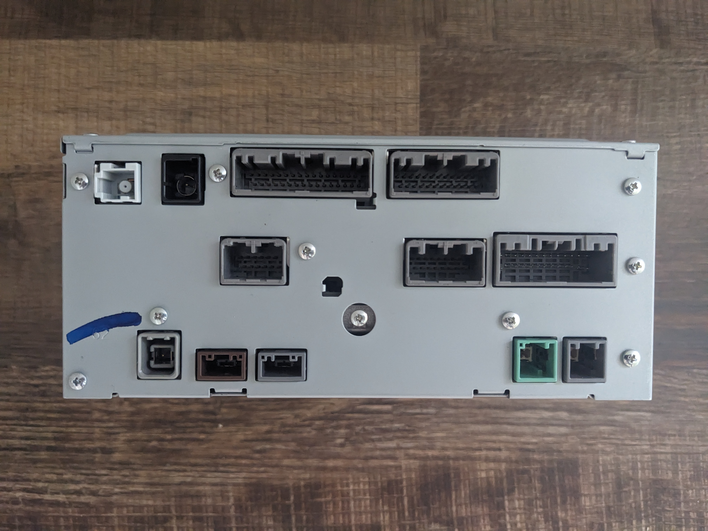
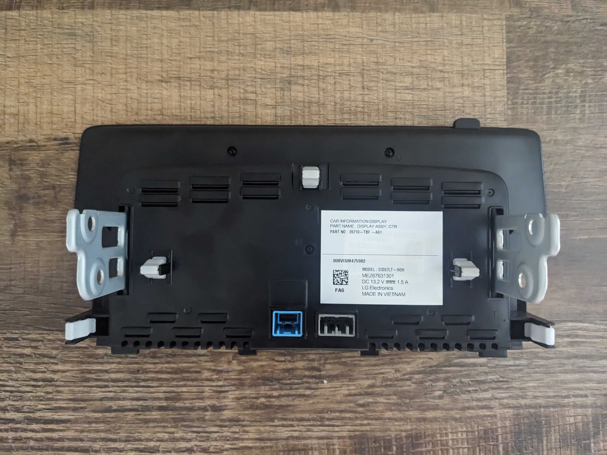
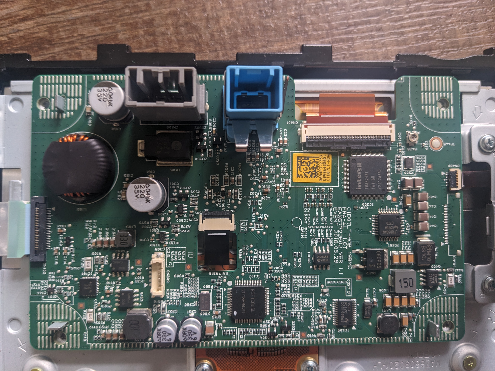
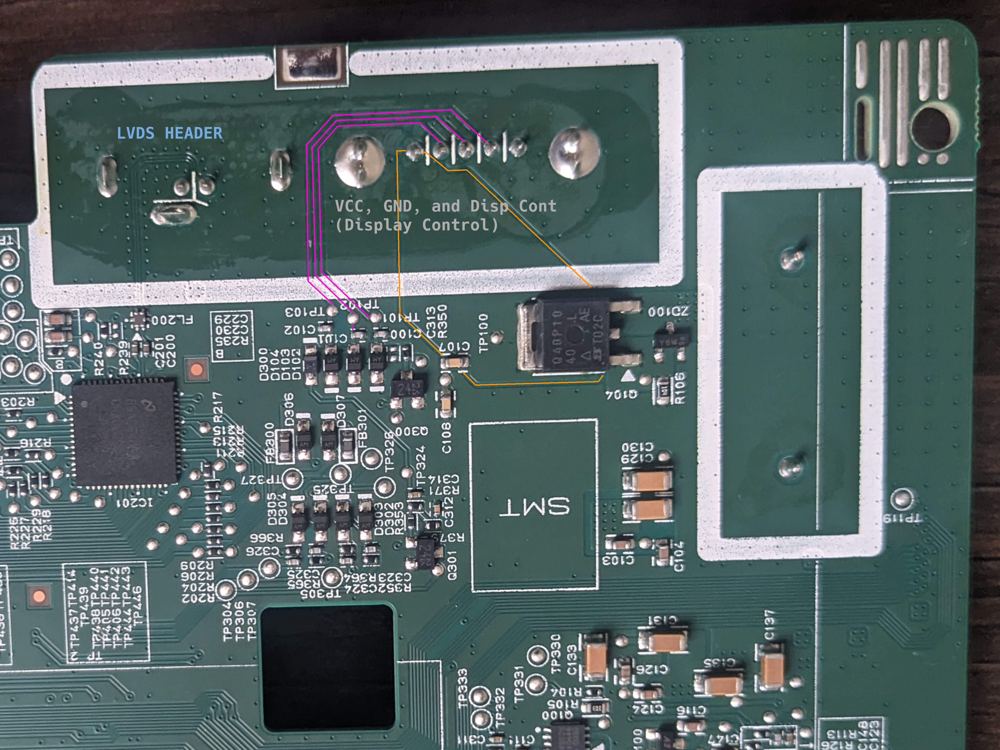

# Headunit Connectors, Anti-Theft
Wiring/connector diagrams provided in the datasheets directory.  
The headunit assembly consists of two physical parts: a metal box and a display assembly.

⚠️ *Before removing the headunit, enable ADB. This lets you bypass the anti-theft lock screen when you reconnect the headunit later.*

The display assembly has two connectors, a light blue connector and a grey connector.
The light blue connector is used for LVDS. The grey connector is used for a display control signal (called `Display Cont` in the connector PDFs)  as well as power and ground. I wasn't able to find documentation on the pinout of the display assembly, so I disassembled it to find out.

Disassembling the display assembly, I found that a pin on one side is connected to GND. The pin on the other side is connected to the drain of a [high-voltage P-Channel MOSFET](https://www.vishay.com/docs/67022/sqd40p10-40l.pdf). I assume this is VCC. The display assembly has a sticker indicating a DC input of 13.2V DC, 1.5A.

Hopefully this proves useful to anyone who wants to power their headunit outside their vehicle.
One last thing; if you do remove the headunit and reconnect it later, you'll have to enter an anti-theft code to "unlock" it. Since I enabled ADB previously and since this anti-theft screen is just an Android activity, I was able to bypass it by launching a different activity within `adb shell`:
```
am start -n com.mitsubishielectric.ada.app.dalauncher/com.mitsubishielectric.ada.app.dalauncher.OpeningDivideActivity
```

  
 
  
  
